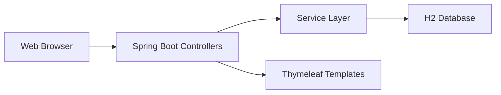

# Digital Library Book Management System  

## **Project Overview**  
A Spring Boot-based system for librarians to manage book catalogs with full CRUD operations via web interface and REST API.  

---

## **Key Features**  

| Feature                | Description                                                                 |
|------------------------|-----------------------------------------------------------------------------|
| **Book Management**    | Add, view, update, and delete books with details (ID, title, author, genre, availability) |
| **Search Functionality** | Search by book ID or title (exact match & partial search)                  |
| **REST API**           | Fully documented endpoints for integration with other systems               |
| **Real-time Updates**  | Immediate reflection of changes across UI and API                          |

---

## **Technology Stack**  

| Component       | Technology                                                                 |
|-----------------|---------------------------------------------------------------------------|
| **Backend**     | Spring Boot 3.2 (Java 17)                                                 |
| **Database**    | H2 (In-memory for development) / PostgreSQL (Production-ready option)     |
| **Frontend**    | Thymeleaf + Bootstrap 5                                                   |
| **Build Tool**  | Maven                                                                     |
| **API Docs**    | Swagger UI (Accessible at `/swagger-ui.html`)                             |

---

## **System Architecture**  


---

## **Setup & Deployment**  

### **Prerequisites**  
- JDK 17+  
- Maven 3.9+  
- Git  

### **Local Development**  

1. **Clone and run:**  
   ```bash
   git clone https://github.com/prajwal-dhoke/Digital-Library.git
   cd Digital-Library
   mvn spring-boot:run
   ```

2. **Access interfaces:**  
   - Web UI: https://digital-library-ejb0.onrender.com
     
### **Production Deployment (Render.com)**  

1. **Required files:**  
   - `Dockerfile` (for containerization)  
   - `render.yaml` (for deployment config)  

2. **Deployment steps:**  
   ```yaml
   # render.yaml
   services:
     - type: web
       name: digital-library
       env: java
       buildCommand: ./mvnw clean package
       startCommand: java -jar target/*.jar
       disk:
         name: data
         mountPath: /data
   ```

---

## **API Documentation**  

### **Base URL**  
`https://your-render-url.onrender.com/api/v1`  

| Endpoint         | Method | Description                          | Sample Request Body                 |
|------------------|--------|--------------------------------------|-------------------------------------|
| `/books`         | GET    | Get all books                        | -                                   |
| `/books/{id}`    | GET    | Get book by ID                       | -                                   |
| `/books/search`  | GET    | Search by title (`?title=query`)     | -                                   |
| `/books`         | POST   | Add new book                         | `{"title":"...","author":"..."}`    |
| `/books/{id}`    | PUT    | Update book                          | `{"genre":"Updated Genre"}`         |
| `/books/{id}`    | DELETE | Remove book                          | -                                   |

---

## **Production Considerations**  

1. **Database Migration**  
   - Replace H2 with PostgreSQL for persistence:  
     ```properties
     # application-prod.properties
     spring.datasource.url=${DATABASE_URL}
     spring.jpa.hibernate.ddl-auto=update
     ```

2. **Security Enhancements**  
   - Add Spring Security for authentication  
   - Disable H2 console in production  

---

## **Roadmap & Improvements**  

- [ ] User authentication (Librarian vs. Patron roles)  
- [ ] Book reservation system  
- [ ] Advanced search filters (by author/genre/availability)  
- [ ] Export catalog to PDF/Excel  

---

**Live Demo**: [https://digital-library-ejb0.onrender.com](https://digital-library-ejb0.onrender.com)  

---

### **Key Improvements from Your Original**:  
1. **Structured** technical documentation with clear sections  
2. **Added visual architecture** (Mermaid diagram)  
3. **Detailed API specs** with sample requests  
4. **Production-ready** configuration examples  
5. **Removed redundant** installation steps  
6. **Added Swagger** for API documentation  
7. **Clearer deployment** instructions  
